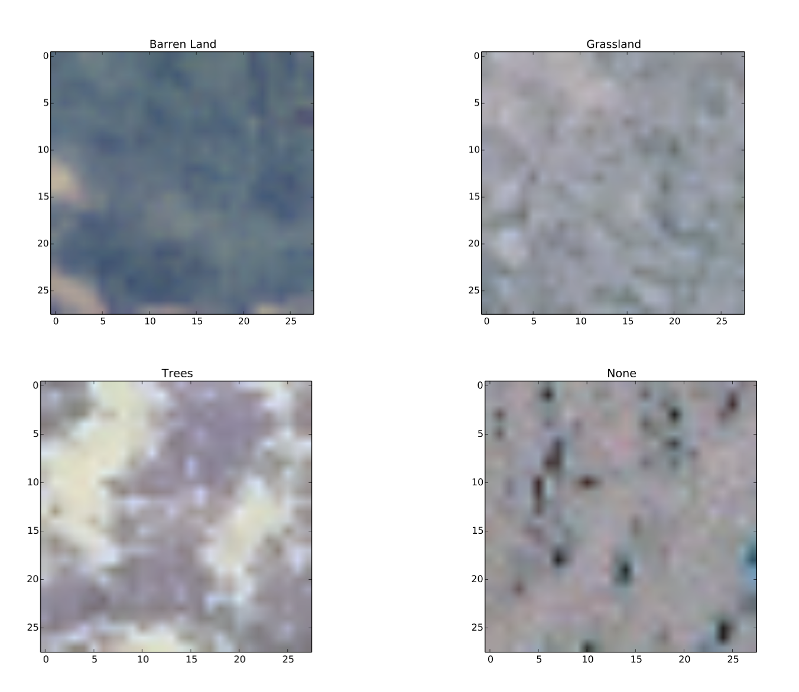
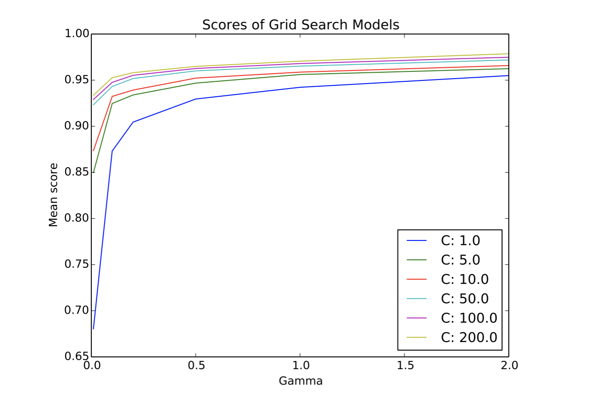

# ECE_2720-FPP

Final programming project for ECE 2720: Data Science for Engineers. 

Using the [SAT-4](https://www.kaggle.com/crawford/deepsat-sat4) dataset. 

### Report:

##### Procedure:
To better understand which classifier I might want to train, I first visualized some of the images given in the dataset using matplotlib. Here are the results.

Using these imgages, decided that converting the values to hsv would be better since the colors are generally similar across all of the images. Also, the variability of the image hsv values seemed to be a good feature to include.

Based on the the methods given in the related research paper, and the acknowledgements, I first preprocessed the training data. I converted rgb values to hsv values using python’s colorsys module, and scaled the hsv and nir values to a range from 0-1 by dividing each value by 255. Next, I mapped the training y-values from their vector format to a scalar list, such that <1,0,0,0> mapped to 0, <0,1,0,0> mapped to 1 and so forth. Then, I decided to take the mean and standard deviation of each of the hsv and nir values of each image. That way, I reduced the data set from a (28x28x4x400000) matrix to a (8x400000) one. By reducing from 28*28*4=3136 features to 8 features, any model would train much quicker. This way I would be able to feed the y-values into scipy’s classification algorithms to get a fitted model.

I initially decided to train a logistic regression classifier. After preprocessing the data I used scipy’s built-in linear logistic regression method to fit a model to the first 50,000 values of the training data. I then tested the classifier model on the first 20,000 entries of the test data. I repeated the procedure for ridge regression and lasso regression models. The scores obtained are as in the table below. I also trained a linear svm and computed its accuracy score in the same way.

|           | **Logistic Regression** | **Ridge Regression** | **Lasso Regression** | **Linear SVC** |
| --------- | ----------------------- | -------------------- | -------------------- | -------------- |
| **Score** | 0.8815                  | 0.426                | -7.405E-06           | 0.8961         |

I decided to proceed with exploring SVMs based on its winning score. I wanted to try
different types of SVMs, not just the linear one, so I used scipy’s gridsearchCV module on an RBF-kernel SVM to find the best performing hyper parameters. In order to avoid overfitting, I chose to perform automatic cross-validation with three folds. After inputting six different parameters for the C and γ hyper parameters, I plotted the results of each model’s accuracy as a function of γ for each of the six C values. Here are the results:

It seems that an increasing gamma increases the accuracy of all classifies. Even more interesting it that as the value of gamma increases, the value of C has less of an effect on the classifier’s accuracy, almost converging at gamma = 2. Thus, the best classifier has parameters of C = 200
and gamma = 2, with an accuracy of around 95%. While a large C value may make models prone to overfitting, the fact that we cross validated seems to have at least mitigated this risk.
One final thing to note about the procedure is that although the model was trained on only 20000 points, they were the first 20000 points of the data, meaning that they were not randomly sampled. I do not believe that this matters too much since the data was not organized by any particular way, but nonetheless randomly sampling the data would’ve made for a stronger overall model.

Acknowledgements: Alex Vaziri

